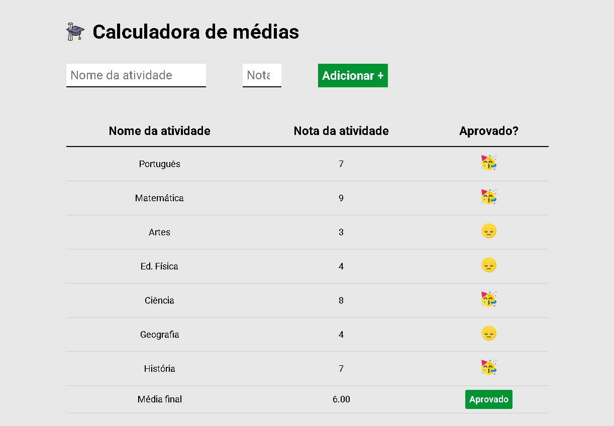

  

# 📊 Calculadora de Médias Escolares

Uma aplicação web interativa desenvolvida para automatizar o registro de notas e o cálculo de médias escolares. O objetivo principal do projeto foi o aprofundamento prático em lógica de programação client-side e na manipulação dinâmica da estrutura de uma página web sem a necessidade de recarregamento.

> 🎓 **Projeto Acadêmico:** Desenvolvido como parte prática da formação frontend da **EBAC (Escola Britânica de Artes Criativas e Tecnologia)**.

---

## 🚀 Tecnologias Utilizadas

O projeto foi construído utilizando a tríade essencial do desenvolvimento web nativo:

* **HTML5** – Estruturação semântica da tabela de notas, formulários de entrada e blocos de resultado.
* **CSS3** – Estilização moderna com foco em legibilidade, utilizando propriedades avançadas de layout para garantir uma interface limpa e organizada.
* **JavaScript (ES6+)** – Responsável por toda a inteligência do sistema (tratamento de eventos, validação de dados, cálculos e injeção de elementos no DOM).

---

## ✨ Funcionalidades e Diferenciais

* **Injeção Dinâmica no DOM:** Adição em tempo real de novas linhas na tabela de notas à medida que o usuário insere as disciplinas e as respectivas avaliações.
* **Cálculo Modular de Média:** Lógica algorítmica isolada que recalcula automaticamente a média geral do aluno a cada nova inserção de dados.
* **Validação de Entradas:** Filtros de segurança que impedem o envio de campos vazios, textos em locais numéricos ou notas fora do intervalo padrão (0 a 10).
* **Indicadores Visuais de Status:** Exibição dinâmica do resultado final ("Aprovado" ou "Reprovado") estilizada com cores distintas (badges de feedback), baseada em uma nota mínima configurável no código.

---

🧠 Principais Aprendizados (EBAC)
Manipulação Avançada de Eventos: Captura e controle de eventos de formulário (submit), prevenindo o comportamento padrão do navegador (preventDefault) para gerenciar os dados de forma assíncrona.

Criação Dinâmica de Elementos: Uso prático de métodos como document.createElement, alteração de propriedades via innerHTML e inserção de nós filhos com appendChild.

Tratamento de Arrays e Tipos: Manipulação de arrays para armazenamento das notas e aplicação de conversões de tipo (Number, parseFloat) para garantir a precisão matemática dos cálculos.
